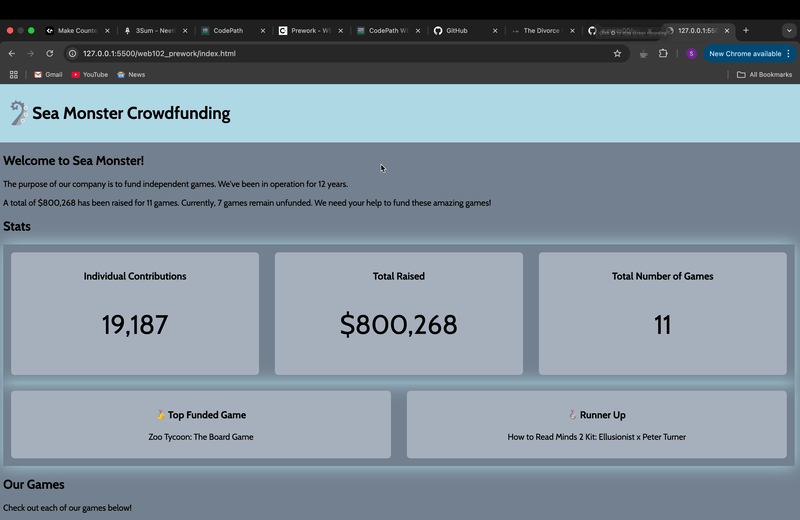

I'll complete the README for you with all the required information filled in:

# WEB102 Prework - Sea Monster Crowdfunding

Submitted by: **Suraj Mishra**

**Sea Monster Crowdfunding** is a website for the company Sea Monster Crowdfunding that displays information about the games they have funded.

Time spent: **5** hours spent in total

## Required Features

The following **required** functionality is completed:

* [x] The introduction section explains the background of the company and how many games remain unfunded.
* [x] The Stats section includes information about the total contributions and dollars raised as well as the top two most funded games.
* [x] The Our Games section initially displays all games funded by Sea Monster Crowdfunding
* [x] The Our Games section has three buttons that allow the user to display only unfunded games, only funded games, or all games.

The following **optional** features are implemented:

* [ ] Add a search functionality to find specific games by name
* [ ] Implement navigation links to quickly jump to different sections
* [ ] Add hover effects and transitions to make the UI more engaging
* [ ] Create a "Donate" button for each unfunded game
* [ ] Add a sorting feature to arrange games by different criteria (funding amount, backers, etc.)

## Video Walkthrough

Here's a walkthrough of implemented features:

<!-- Replace this with whatever GIF tool you used! -->
GIF created with [QuickTime Player](https://support.apple.com/en-us/106375) for screen recording and [Gifski](https://gif.ski) for conversion to GIF format

## Notes

While building this app, I faced some challenges with:
- Implementing the correct filtering functions using array methods
- Understanding how to use the reduce method effectively for statistics
- Setting up the event listeners properly for the filter buttons
- Figuring out the correct way to use destructuring to display top games

This project helped me learn a lot about JavaScript array methods, DOM manipulation, and handling event listeners.

## License

    Copyright 2025 Suraj Mishra

    Licensed under the Apache License, Version 2.0 (the "License");
    you may not use this file except in compliance with the License.
    You may obtain a copy of the License at

        http://www.apache.org/licenses/LICENSE-2.0

    Unless required by applicable law or agreed to in writing, software
    distributed under the License is distributed on an "AS IS" BASIS,
    WITHOUT WARRANTIES OR CONDITIONS OF ANY KIND, either express or implied.
    See the License for the specific language governing permissions and
    limitations under the License.